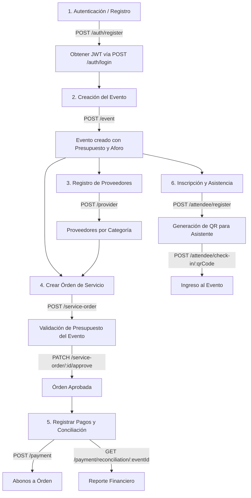

# Sistema de Gestión de Eventos Corporativos

Una solución backend robusta y escalable construida con **NestJS**, **TypeORM** y **PostgreSQL** diseñada para la planificación, organización y control financiero de eventos corporativos.

El sistema permite gestionar todo el ciclo de vida de un evento: desde el control de aforo e inscripción de asistentes con validación de accesos vía código QR, hasta el alta de proveedores por categoría, la emisión y aprobación de órdenes de servicio, el registro de pagos parciales/totales y la conciliación financiera en tiempo real.

---

## Tecnologías Clave

* **Framework Core**: [NestJS (v11)](https://nestjs.com/) - Arquitectura modular y extensible.
* **Lenguaje**: TypeScript.
* **Persistencia de Datos**: [PostgreSQL](https://www.postgresql.org/) con [TypeORM](https://typeorm.io/).
* **Autenticación & Seguridad**: JWT (JSON Web Tokens), Passport, Bcrypt, y Control de Acceso Basado en Roles (RBAC).
* **Validación de Datos**: `class-validator` y `class-transformer` para validación y transformación estricta de DTOs.
* **Documentación de API**: Swagger / OpenAPI (disponible en `/api`).
* **Testing**: Jest & Supertest para pruebas unitarias y de integración.

---

## Requisitos Previos

Antes de comenzar, asegúrate de contar con lo siguiente en tu entorno local:

1. **Node.js**: Versión 18.x o superior.
2. **npm**: Gestor de paquetes incluido con Node.js.
3. **Instancia de PostgreSQL**: 
   - **Localmente**: Instala PostgreSQL de forma nativa en tu sistema operativo y asegúrate de que el servicio esté corriendo en el puerto por defecto (`5432`).
   - **En la Nube**: Obtén las credenciales de conexión (Host, Puerto, Usuario, Contraseña, Nombre de la DB) de tu proveedor cloud.

---

## Instalación y Configuración

### 1. Clonar el repositorio e instalar dependencias

```bash
git clone <URL_DEL_REPOSOTORIO>
cd sistema-eventos-corporativos
npm install
```

### 2. Crear la Base de Datos

En tu instancia de PostgreSQL (vía `psql`, pgAdmin o cliente preferido), crea la base de datos para el proyecto:

```sql
CREATE DATABASE corporate_events;
```

### 3. Configurar las Variables de Entorno (`.env`)

Crea un archivo llamado `.env` en la raíz del proyecto. Puedes tomar el siguiente ejemplo como plantilla:

```env
# Clave secreta para la firma y verificación de tokens JWT
JWT_SECRET=tu_secreto_super_seguro_jwt_2026

# Configuración de Conexión a la Base de Datos PostgreSQL
DB_HOST=localhost
DB_PORT=5432
DB_USERNAME=postgres
DB_PASSWORD=tu_contraseña_local
DB_NAME=corporate_events
```

*Si usas un servicio de PostgreSQL en la nube, reemplaza `DB_HOST`, `DB_PORT`, `DB_USERNAME`, `DB_PASSWORD` y `DB_NAME` con las credenciales provistas por tu proveedor.*

---

## Ejecución del Proyecto

### Modo Desarrollo (con Live Reload)
```bash
npm run start:dev
```
La aplicación estará escuchando en `http://localhost:3000`.

### Compilación y Producción
```bash
# Compilar el proyecto a JavaScript
npm run build

# Ejecutar el build de producción
npm run start:prod
```

---

## Pruebas (Testing)

El proyecto cuenta con suites de pruebas unitarias y de integración desarrolladas con Jest.

```bash
# Ejecutar todas las pruebas unitarias
npm test

# Ejecutar pruebas en modo observador (watch mode)
npm run test:watch

# Generar reporte de cobertura de código (coverage)
npm run test:cov

# Ejecutar pruebas end-to-end (e2e)
npm run test:e2e
```

---

## Documentación Interactiva de la API (Swagger)

La API cuenta con documentación interactiva generada con **Swagger**. 

Una vez iniciada la aplicación, accede desde tu navegador web a:

👉 **[http://localhost:3000/api](http://localhost:3000/api)**

### ¿Cómo autenticarse en Swagger?
1. Realiza una petición `POST` al endpoint `/auth/login` con tus credenciales.
2. Copia el token de acceso JWT retornado en la respuesta.
3. En la parte superior derecha de la interfaz de Swagger, haz clic en el botón **Authorize**.
4. Pega el token y confirma. ¡Ahora podrás probar todos los endpoints protegidos directamente desde Swagger!

---

## Mapa de la API y Módulos Principales

La arquitectura modular está dividida en los siguientes dominios de negocio:

### 1. Auth (`/auth`)
Gestión de identidad, registro e inicio de sesión con contraseñas encriptadas mediante `bcrypt`.
* `POST /auth/register`: Registrar un nuevo usuario (`Admin` u `Organizador`).
* `POST /auth/login`: Autenticarse y recibir un JSON Web Token (JWT).

### 2. Event (`/event`)
Administración de eventos corporativos, definición de fechas, lugar, presupuesto aprobado y aforo máximo.
* `POST /event`: Crear un nuevo evento (Requiere rol `Admin`).
* `GET /event`: Listar todos los eventos.
* `GET /event/:id`: Obtener detalles de un evento específico.
* `PATCH /event/:id`: Actualizar información de un evento (Requiere rol `Admin`).
* `DELETE /event/:id`: Eliminar un evento (Requiere rol `Admin`).

### 3. Attendee (`/attendee`)
Gestión de participantes, inscripciones y control de asistencia mediante códigos QR únicos.
* `POST /attendee/register`: Inscribir un asistente a un evento (valida que no se exceda el aforo máximo ni existan correos duplicados por evento).
* `POST /attendee/check-in/:qrCode`: Escanear o registrar la entrada del asistente mediante su código QR (Requiere roles `Admin` u `Organizador`).

### 4. Provider (`/provider`)
Registro y mantenimiento de proveedores clasificados por categorías (`Catering`, `Audiovisual`, `Decoración`, `Logística`).
* `POST /provider`: Registrar un nuevo proveedor (Requiere rol `Admin`).
* `GET /provider`: Listar proveedores (filtro opcional por `category`).
* `GET /provider/:id`: Obtener la ficha de un proveedor por ID.
* `PATCH /provider/:id`: Actualizar datos de un proveedor (Requiere rol `Admin`).
* `DELETE /provider/:id`: Eliminar un proveedor (solo si no tiene órdenes de servicio asociadas).

### 5. Service Order (`/service-order`)
Órdenes de compra/servicio vinculadas a un evento y a un proveedor.
* `POST /service-order`: Crear una orden de servicio (valida que el monto no exceda el presupuesto aprobado del evento).
* `GET /service-order`: Listar todas las órdenes de servicio.
* `GET /service-order/event/:eventId`: Listar órdenes asignadas a un evento específico.
* `GET /service-order/provider/:providerId`: Listar órdenes asignadas a un proveedor.
* `GET /service-order/:id`: Consultar una orden específica.
* `PATCH /service-order/:id/approve`: Aprobar una orden de servicio (Requiere rol `Admin`).
* `PATCH /service-order/:id`: Actualizar el monto de una orden (Requiere roles `Admin` u `Organizador`).
* `DELETE /service-order/:id`: Eliminar una orden de servicio (solo si no posee pagos registrados).

### 6. Payment (`/payment`)
Módulo financiero para abonar a órdenes de servicio aprobadas y verificar estados de cuenta.
* `POST /payment`: Registrar un pago parcial o final hacia una orden de servicio aprobada (valida que el saldo no se exceda y que no existan órdenes pendientes de aprobación para el proveedor).
* `GET /payment`: Listar el historial de pagos.
* `GET /payment/:id`: Obtener el detalle de un pago por ID.
* `GET /payment/provider/:providerId/balance`: Consultar el saldo pendiente global de un proveedor.
* `GET /payment/reconciliation/:eventId`: Reporte de conciliación financiera del evento (Presupuesto vs. Gasto Real vs. Varianza desglosada por categoría de proveedor).

---

## Flujo Lógico de Uso del Sistema

Para experimentar la integración completa del sistema, se sugiere seguir el siguiente flujo operativo:



1. **Autenticación**: Registra un usuario inicial (`/auth/register`) e inicia sesión (`/auth/login`) para obtener el Bearer Token.
2. **Crear un Evento**: Define un evento con un presupuesto asignado (ej. `$50,000`) y un aforo máximo (ej. `200` personas).
3. **Alta de Proveedores**: Registra proveedores en las categorías requeridas (ej. `Catering`, `Audiovisual`).
4. **Emitir y Aprobar Órdenes de Servicio**:
   - Crea una orden de servicio para el proveedor asignado al evento. El sistema verificará automáticamente que el monto acumulado no supere el presupuesto del evento.
   - Un usuario con rol `Admin` aprueba la orden (`/service-order/:id/approve`).
5. **Registrar Pagos y Conciliar**:
   - Registra abonos o el pago total (`/payment`) para liquidar la orden aprobada.
   - Consulta la conciliación financiera (`/payment/reconciliation/:eventId`) para obtener la varianza entre lo presupuestado y lo gastado en tiempo real.
6. **Gestión de Asistentes y Check-in**:
   - Registra asistentes al evento (`/attendee/register`). Se verificará que el aforo disponible no haya sido alcanzado.
   - Al momento del evento, realiza el check-in escaneando el `qrCode` (`/attendee/check-in/:qrCode`).

---

